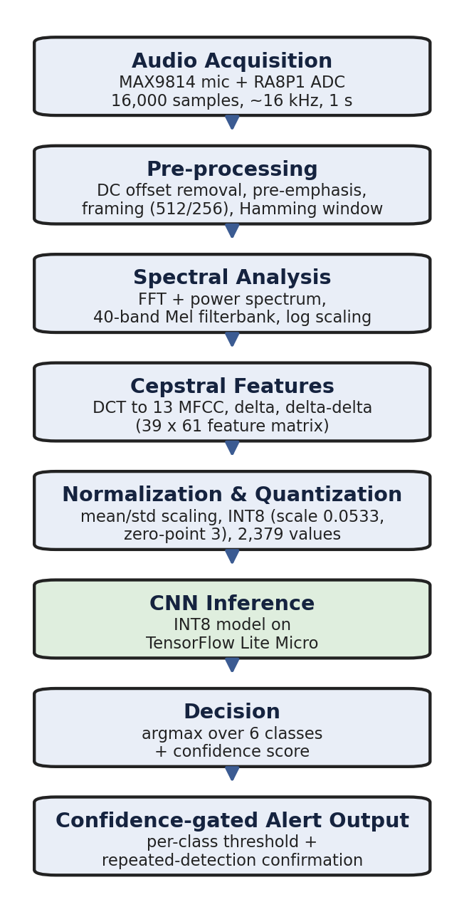

# AI-Powered Acoustic Event Detection

An embedded Edge AI system for real-time detection of attention-critical domestic sounds on a resource-constrained microcontroller.

## Overview

This project performs audio capture, signal processing, machine-learning inference, and alert decisions entirely on a **Renesas RA8P1 Titan Board** running **RT-Thread**. Keeping inference on the device reduces cloud dependence, latency, and the privacy risk of streaming domestic audio.

The classifier recognises six classes:

- Baby Crying
- Glass Breaking
- Alarm/Siren
- Door Knock
- Doorbell
- Unknown/Background

## Highlights

| Item | Result |
| --- | --- |
| Audio input | 1-second frames, 16,000 ADC samples |
| Measured sampling rate | Approximately 15,904 Hz |
| Features | 13 MFCC + delta + delta-delta |
| Model input | 39 × 61 × 1 |
| Model | 102,214-parameter INT8 CNN |
| Test result | 87.5% accuracy (14/16 windows) |
| Model size | 114.4 KB |
| Tensor arena | 180 KB |
| Runtime | TensorFlow Lite for Microcontrollers |

> The accuracy result comes from a small board-focused test split and should be read as an embedded feasibility result, not a large-scale benchmark.

## Hardware

- Renesas RA8P1 Titan Board
- MAX9814 microphone amplifier module
- ADC0 audio input
- Optional Titan Board LCD for the current alert-interface enhancement

### MAX9814 connection

| MAX9814 pin | RA8P1 connection | Purpose |
| --- | --- | --- |
| VDD | 3.3 V | Module power |
| GND | Ground | Common reference |
| OUT | ADC0 input | Analog audio signal |
| GAIN | 3.3 V | 40 dB gain configuration |

## Processing pipeline

1. Capture 16,000 ADC samples over approximately one second.
2. Remove the DC offset and apply pre-emphasis.
3. Split the signal into 512-sample frames with a 256-sample hop.
4. Apply a Hamming window and a CMSIS-DSP FFT.
5. Calculate a 40-band Mel filterbank and 13 MFCC values.
6. Append delta and delta-delta features to form a 39 × 61 matrix.
7. Normalize and quantize the 2,379 features to INT8.
8. Run the CNN with TensorFlow Lite Micro.
9. Apply per-class thresholds, repeated-hit confirmation, and cooldown logic.
10. Report the result through serial output and the optional LCD interface.

## Model architecture

The network uses only the operators registered by the embedded interpreter:

- Conv2D
- Add
- Mul
- MaxPool2D
- AveragePool2D
- Softmax

This restricted operator set keeps the deployment compact and avoids runtime allocation failures caused by unsupported operators.

## Source guide

| File | Responsibility |
| --- | --- |
| [`firmware/src/hal_entry.c`](firmware/src/hal_entry.c) | ADC capture, preprocessing, FFT/MFCC extraction, quantization, alert logic, and application loop |
| [`firmware/src/cpp_test.cpp`](firmware/src/cpp_test.cpp) | TensorFlow Lite Micro initialization, operator resolver, tensor validation, and inference |
| [`firmware/src/sound_model.h`](firmware/src/sound_model.h) | Generated 117,136-byte INT8 model |
| [`firmware/src/mfcc_norm_params.h`](firmware/src/mfcc_norm_params.h) | Training-derived feature-normalization parameters |
| [`firmware/src/lcd_alert_ui.c`](firmware/src/lcd_alert_ui.c) | Current LCD monitoring, verification, alert, and error screens |
| [`firmware/project-config/`](firmware/project-config/) | RT-Thread and Renesas FSP configuration snapshots |

The public repository is a curated application-layer snapshot. Large SDK, package, generated build, and IDE cache folders are intentionally excluded.

## Results

INT8 quantization reduced the model from 403.8 KB to 114.4 KB while allowing it to execute with a 180 KB tensor arena.

The held-out board-recorded test split contained 16 one-second windows. Door Knock was the weakest class, while sustained sounds such as Baby Crying and Alarm/Siren were more stable.

Live testing produced stable detections for Doorbell, Alarm/Siren, and Baby Crying. Short transient classes—Glass Breaking and Door Knock—were less consistent because their key acoustic content can fall partly outside a fixed one-second capture window.

## Current enhancement

The thesis-era prototype reported alerts through the serial terminal. The current working version adds an LCD interface with:

- Listening/monitoring state
- Candidate verification progress
- Confirmed alert display
- Confidence indicator
- System error screen

This LCD work is newer than the documented thesis results and is identified separately to avoid overstating the original evaluation.

## Reproducing the firmware

See [`firmware/README.md`](firmware/README.md) for the project-layout, dependency, and integration notes.

## Limitations and future work

- Expand the board-recorded dataset across rooms, distances, volumes, and sound sources.
- Improve the balance and sample count for transient classes.
- Replace block-wise capture with an overlapping sliding window or ring buffer.
- Validate the current LCD integration across clean rebuilds.
- Add physical or wireless notifications such as a buzzer, LED, or IoT message.

## Author

**Khairul Fawwaz bin Kamaruzaman**

Mechatronic Engineering Graduate, Universiti Sains Malaysia

[LinkedIn](https://www.linkedin.com/in/khairulfawwaz)

## Third-party components

This project integrates RT-Thread, Renesas FSP, CMSIS-DSP, and TensorFlow Lite for Microcontrollers. See [`THIRD_PARTY_NOTICES.md`](THIRD_PARTY_NOTICES.md).
