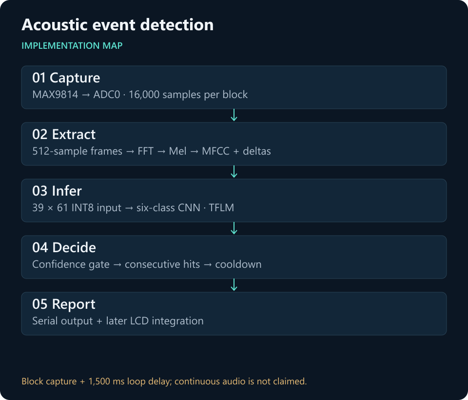
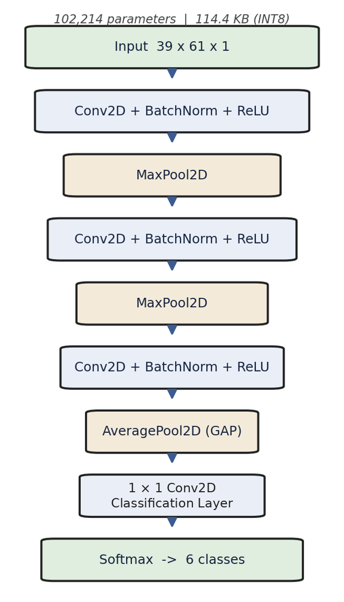
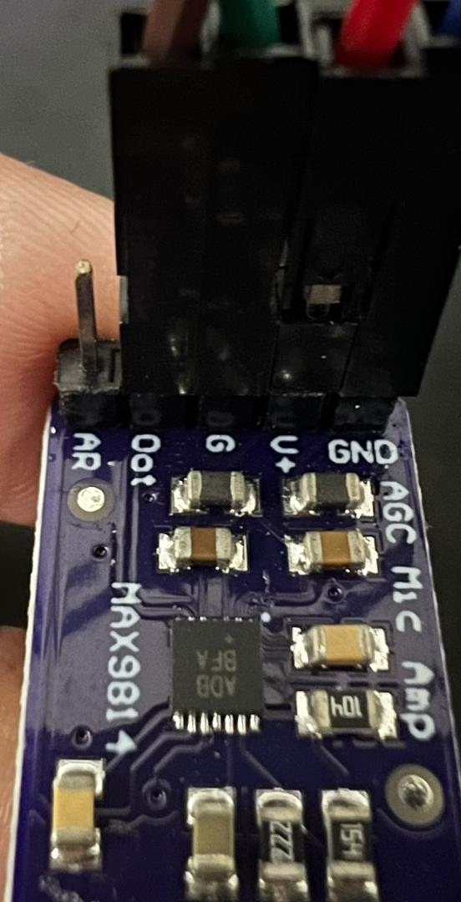
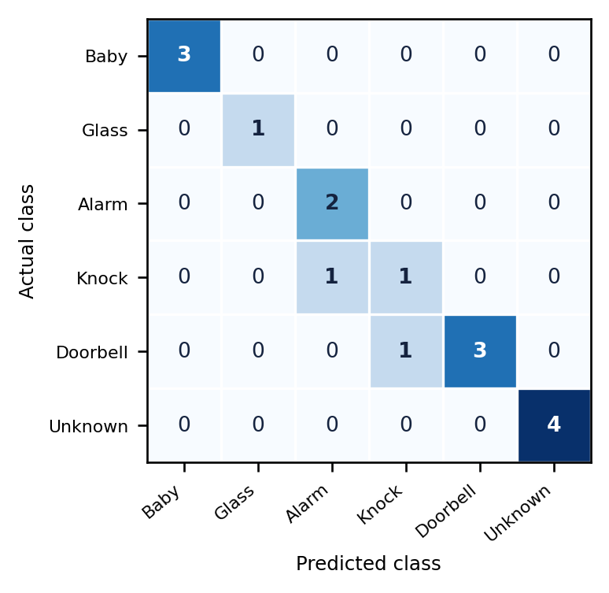
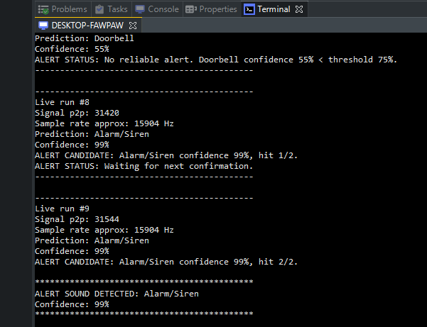
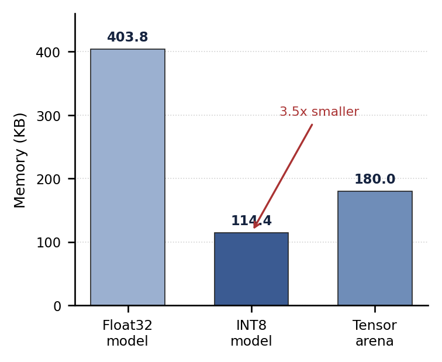

# Acoustic event detection at the edge

**Final-year project · Mechatronic Engineering · Universiti Sains Malaysia**

An embedded prototype that recognises six domestic sound categories on a Renesas RA8P1 Titan Board. Audio capture, feature extraction, INT8 CNN inference and alert decisions run on the device.

**Status:** application-layer firmware snapshot, with thesis-era evaluation and a later LCD extension. A complete BSP, training pipeline and evaluation audio are not included.

> Maintenance corrected an input-scale mismatch between the embedded model and firmware. **16 host tests and a fresh local full-BSP build pass.** The corrected firmware has not been flashed or evaluated on the board. The historical 14/16 result below is not a measurement of this revision. See the [software verification record](docs/software-validation.md).

[Core implementation](firmware/src/hal_entry.c) · [Model runtime](firmware/src/cpp_test.cpp) · [Results](#validation-and-results) · [Integration](firmware/README.md) · [Portfolio](https://github.com/KhaiFaw)



## Problem and scope

Domestic sounds such as alarms, doorbells and breaking glass can convey useful events without a camera or cloud audio stream. This project explores whether a compact microcontroller pipeline can extract the signal, classify it locally and suppress unreliable alerts.

Classes: Baby Crying, Glass Breaking, Alarm/Siren, Door Knock, Doorbell and Unknown/Background. This is a feasibility prototype, not a certified safety or emergency device.

## Engineering contributions

The project-specific application layer integrates ADC capture, DSP stages, model normalization/quantization, C-to-C++ inference calls, class thresholds, repeated-hit confirmation and serial/LCD states. The two main implementation files are `hal_entry.c` and `cpp_test.cpp`.

RT-Thread supplies the operating-system framework, Renesas FSP the device support, CMSIS-DSP the FFT implementation and TensorFlow Lite Micro the interpreter. The repository includes generated model/normalization arrays; the script named in their headers is not included. Source history alone does not establish the model's full training or dataset provenance.

## Architecture and implementation

1. Capture **16,000 samples** from MAX9814 via ADC0.
2. Remove DC offset and apply pre-emphasis.
3. Process **512-sample** frames with a **256-sample** hop, Hamming window and FFT.
4. Compute **40 Mel bands**, **13 MFCCs**, deltas and delta-deltas.
5. Normalize the **39 × 61** features with the paired arrays and quantize to INT8.
6. Invoke the CNN through a six-operator TFLM resolver.
7. Apply class-specific confidence thresholds, hit counts and a five-second cooldown.
8. Show serial output and, where the board display stack is available, LCD status.

The model input is `[1, 39, 61, 1]`; the actual output is `[1, 1, 1, 6]`. The C++ runtime interprets those six bytes as class scores. Model/normalization integrity checks are described in [verification notes](docs/verification.md).



## Hardware and setup

- Renesas RA8P1 Titan Board
- MAX9814 microphone amplifier: VDD to 3.3 V, GND to ground, OUT to the configured ADC0 input, GAIN to 3.3 V
- RT-Thread Studio, the matching Titan BSP/FSP, CMSIS-DSP and TensorFlow Lite Micro
- Serial console on UART8 at 115200 baud, as configured in the source
- Matching GLCDC/MIPI display configuration for the LCD extension



A fresh local build with Arm GNU 13.3.Rel1 is recorded in the [software verification notes](docs/software-validation.md). It uses an isolated copy of the owner's existing Titan BSP and configuration, which are not bundled here. Physical ADC wiring and runtime behaviour remain unverified for this revision. Follow [firmware integration notes](firmware/README.md); this repository cannot be flashed by itself.

## Validation and results

| Evidence | Value | Interpretation |
|---|---|---|
| Historical board-recorded evaluation | **14/16 windows correct (87.5%)** | Small thesis-era split; evaluation audio/predictions are not included |
| Embedded model, read from header | **117,136 bytes / 114.39 KiB** | Model artifact size, not total flash usage |
| Tensor arena configured in code | **180 KiB** | One allocation; excludes capture/DSP buffers, stacks and other RAM |
| Historical sample-rate observation | Approximately **15,904 Hz** | Previously documented board observation; not remeasured here |
| Current artifact verification | **16 host tests pass** | Model structure, normalization, firmware quantization and malformed-metadata regressions; no board execution |
| Current local firmware build | **Full staged BSP build passes** | Corrected application compiled and linked; no flash, inference or acoustic evaluation |



The matrix has 3 baby, 1 glass, 2 alarm, 2 knock, 4 doorbell and 4 background windows. One knock is classified as alarm and one doorbell as knock. These counts do not establish performance across rooms, people, microphones or distances.



The original documentation also compares float and quantized model storage. That comparison is retained as historical evidence, not a fresh measurement:



## Run the hardware-independent checks

Requires Python 3.12 and internet access for the initial dependency install. From the repository root:

```powershell
python -m venv .venv
.\.venv\Scripts\python.exe -m pip install -r requirements-checks.txt
.\.venv\Scripts\python.exe tools/check_model_contract.py
.\.venv\Scripts\python.exe -m unittest discover -s tests -v
```

On Linux/macOS use `.venv/bin/python`. The Actions workflow runs these same checks without board SDKs. It does not compile the firmware, run the CNN or measure acoustic accuracy. The separately recorded [local firmware build](docs/software-validation.md) uses the full existing BSP.

## Design decisions and limitations

- **Block capture:** capture, DSP and inference are sequential; `FINAL_DEMO_DELAY_MS=1500` adds a delay after each cycle. This does not provide continuous audio coverage or a measured end-to-end latency guarantee.
- **Demo gating:** `CLEAN_BACKGROUND_OUTPUT_MODE=1` sends quiet or low-confidence predictions to background before alert handling. Record that setting when evaluating; do not silently count filtered output as raw classifier performance.
- **Transient sounds:** knock and glass events can fall outside the fixed capture window. Repeated-hit rules can further delay confirmation.
- **LCD scope:** LCD code postdates the historical evaluation. It needs clean-build and board validation separately.
- **Reproducibility:** training source, source audio licenses, split protocol and exact BSP/package versions remain missing.
- **Maintenance correction:** the checked-in model scale is `0.05333127826452255`; the previous firmware constant was `0.088802`. This revision aligns the constant and adds a regression check. It does not assert an accuracy improvement.

## Repository guide

| Path | Purpose |
|---|---|
| [hal_entry.c](firmware/src/hal_entry.c) | Capture, MFCC/deltas, quantization, alert logic and loop |
| [cpp_test.cpp](firmware/src/cpp_test.cpp) | TFLM interpreter, resolver and inference bridge |
| [sound_model.h](firmware/src/sound_model.h) / [normalization](firmware/src/mfcc_norm_params.h) | Paired generated artifacts |
| [LCD UI](firmware/src/lcd_alert_ui.c) | Monitoring, verification, alert and error displays |
| [project configuration](firmware/project-config/) | FSP/RT-Thread configuration snapshots |
| [contract checker](tools/check_model_contract.py) / [tests](tests/test_model_contract.py) | Host-side artifact checks and malformed-input regressions |
| [verification](docs/verification.md) / [software validation](docs/software-validation.md) | Evidence boundary, recorded local build and future board acceptance steps |

## Next validation steps

The corrected application now compiles and links against the local Titan BSP. Future hardware work is to confirm the generated target/linker settings, compare raw features and model output against the paired training pipeline, and retest the quantization correction on the board. Then capture a larger, balanced board dataset and measure missed-event rate, false alerts, latency and total RAM. Overlapping acquisition is a future improvement, not an implemented feature.

## Attribution and license

Khairul Fawwaz bin Kamaruzaman · Mechatronic Engineering graduate, USM.

See [third-party notices](THIRD_PARTY_NOTICES.md). Included CMSIS sources retain their Apache-2.0 license. A license for the project's original application code has not been selected; model/dataset redistribution rights also need confirmation. No new license is granted by this documentation.
